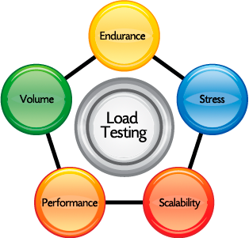

+++
## Jmeter

+++

### What Is It?

JMeter is an Apache project that can be used as a load testing tool for analyzing and measuring the performance of a variety of services, with a focus on web applications.

+++

### How Can We Use It?

Main use was primarily for load / stress testing.

Iris now has functionality to run Jmeter scripts.
+++

### How Do We Use It?
GUI - create our test scripts

CLI - run them
+++

### Some Useful Sites
Apache Docs and Download - http://jmeter.apache.org

Blazemeter Docs and Examples - https://www.blazemeter.com/jmeter

Tutorial - https://www.tutorialspoint.com/jmeter/
+++
### Online Repo
https://github.com/ahale212/jmeter
+++

### Feedback / Questions
Gauge feedback `ahalh` / Direct feedback

Any Questions?
